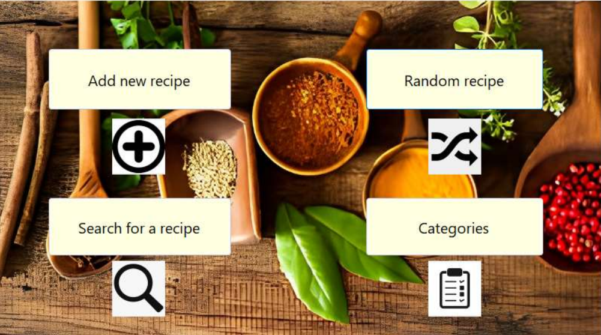
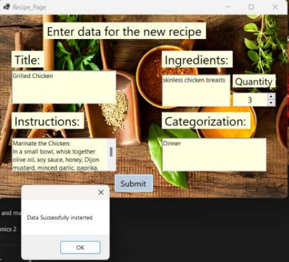
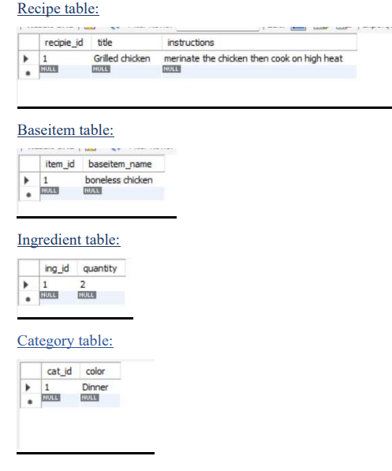

Recipe Organizer:
1. Recipe Class:
Description: The Recipe class is the cornerstone of our Recipe Organizer, embodying a recipe with attributes such as
RecipeID , Title , Instructions , and a list of BaseItem instances. It manages both Ingredient and Category items, showcasing
inheritance for code reusability. Methods include functionalities for adding ingredients, editing instructions, and retrieving
recipe details.
2. BaseItem Class: (Base class for Ingredient and Category)
Description: The BaseItem class serves as the base class for both Ingredient and Category . It encapsulates common
attributes such as ItemID and Name . This class promotes code reusability and maintains a consistent structure for items
associated with recipes.
3. Ingredient Class (Inherits from BaseItem):
Description: The Ingredient class represents individual ingredients that constitute a recipe. It inherits attributes from the
BaseItem class and includes additional attributes like Quantity . This class enables the association of multiple ingredients
with a single recipe.
4. Category Class (Inherits from BaseItem):
Description: The Category class represents the categorization of recipes. It inherits attributes from the BaseItem class and
includes specific attributes like Color for visual distinction. Recipes can be organized into different categories to facilitate
easy searching and management.
5. UserInterface Class:
Description: The UserInterface class is the dynamic heart of our Recipe Organizer. It serves as the front-end manager,
orchestrating the interaction between users and the system. Beyond its previous responsibilities, it now actively maintains
lists of ingredients and recipes, ensuring seamless data management. This means that as users add new recipes or
ingredients, the UserInterface class keeps track of them for easy access and display.
Main Responsibilities:
1. Display Main Menu:
Upon starting the program, the UserInterface class presents a main menu, offering options like adding recipes,
categorizing them, searching, and selecting a random recipe.
2. Add Recipe Page:
Users interested in adding a new recipe are directed to a dedicated page within the UserInterface class. This
page guides them through entering details such as title, instructions, ingredients, and categorization.
3. Categorize Recipes:
The UserInterface offers functionality for categorizing recipes, allowing users to organize their collection
efficiently.
4. Search for Recipes:
To simplify access to specific recipes, the UserInterface includes a search feature, enabling users to find recipes
based on titles, ingredients, or categories.
5. Random Recipe Page:
For a bit of culinary adventure, the UserInterface provides an option to select a random recipe from the stored
collection.
6. Program Class:

Projects Ideas 7
Description: The Program class serves as the entry point for the Recipe Organizer application. It contains the Main method,
where instances of other classes are created, and methods are called to run the program. This class coordinates the flow of
the application, ensuring a smooth and organized execution.
Note:
Given the project's relatively small number of classes compared to other ideas, there is room for enhancing the interface or
expanding functionality. Students are encouraged to suggest additional classes to further enrich the project

***The user interface mainly consists of 4 pages:***
• Add new recipe (saves data to be used later)
• Random recipe (shows a random recipe previously entered )

• Search for a recipe (searches the data base for previously entered 
recipes by name )
• Categories (allows the user to sort the recipes as they please ex: 
blue/red/… or dinner/dessert/… )

***The UML diagram :***

***Data Base:***

